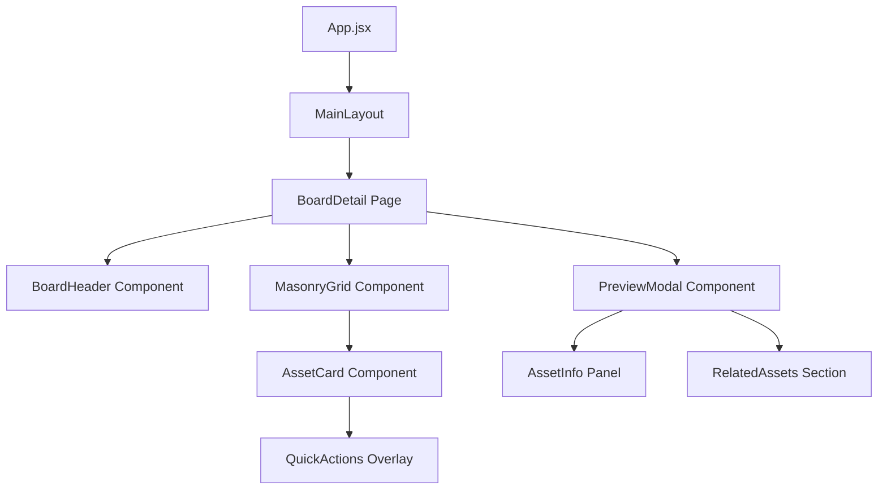
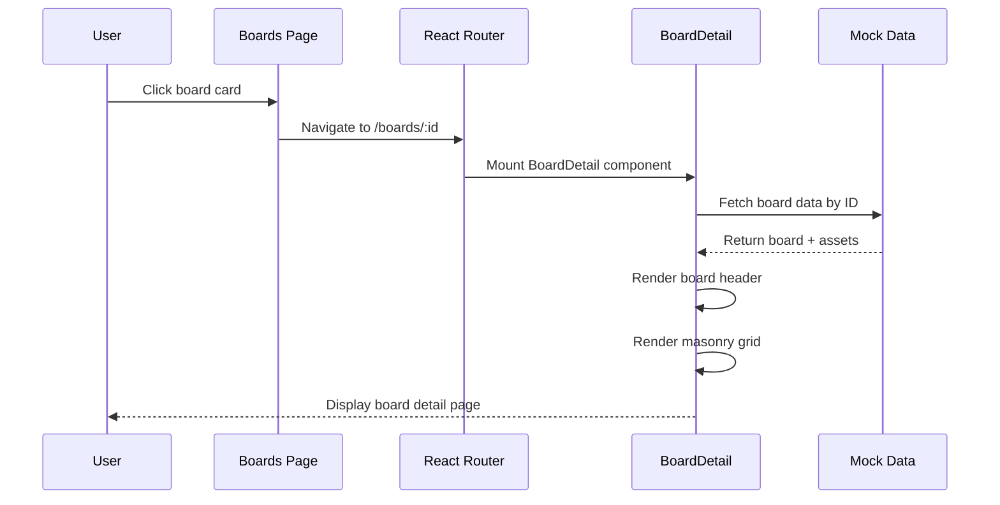
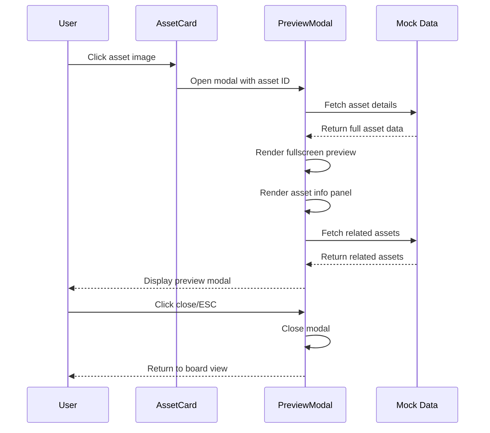
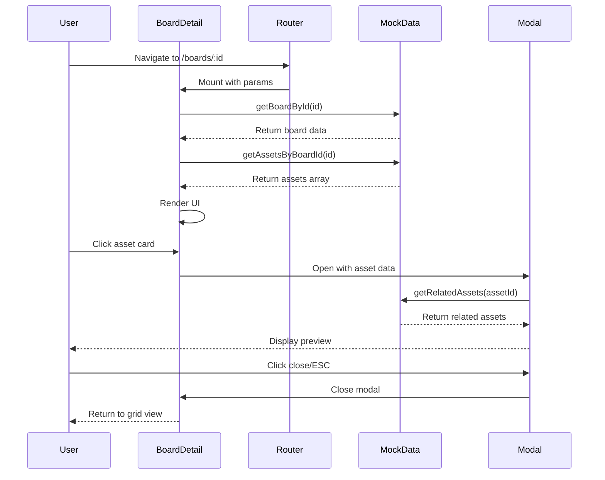

# Design Document: Board Detail Page

## Overview

Halaman Board Detail adalah halaman yang menampilkan detail dari sebuah board inspirasi kreatif dalam aplikasi Moodspace. Halaman ini menampilkan koleksi aset visual dalam layout masonry grid (Pinterest-style) dengan interaksi hover yang smooth, preview modal untuk melihat detail aset, dan kemampuan untuk menambahkan aset ke project atau board lain. Desain menggunakan futuristic dark glassmorphism aesthetic dengan dominasi warna hitam, ungu neon, dan cyan glow yang konsisten dengan halaman lain di aplikasi.

Halaman ini diakses melalui route `/boards/:id` dan menggunakan React Router untuk navigasi. User dapat melihat informasi board (nama, deskripsi, kategori, jumlah aset), menjelajahi koleksi aset dalam masonry grid, dan berinteraksi dengan setiap aset (preview, save, download, add to project).

## Architecture



**Component Hierarchy:**
- **App.jsx**: Root router configuration
- **MainLayout**: Layout wrapper dengan Sidebar dan Header
- **BoardDetail**: Main page component
  - **BoardHeader**: Header section dengan board info dan actions
  - **MasonryGrid**: Container untuk masonry layout
    - **AssetCard**: Individual asset card dengan hover effects
      - **QuickActions**: Overlay dengan action buttons
  - **PreviewModal**: Fullscreen modal untuk preview aset
    - **AssetInfo**: Panel informasi aset
    - **RelatedAssets**: Section untuk related inspirations

## Sequence Diagrams

### Main User Flow: View Board Detail



### Asset Preview Flow



## Components and Interfaces

### Component 1: BoardDetail (Main Page)

**Purpose**: Main page component yang mengatur layout dan state untuk halaman board detail

**Interface**:
```typescript
interface BoardDetailProps {
  // No props - uses route params
}

interface BoardDetailState {
  board: Board | null
  assets: Asset[]
  selectedAsset: Asset | null
  isModalOpen: boolean
  isLoading: boolean
}

interface Board {
  id: string
  name: string
  description: string
  category: string[]
  lastUpdated: string
  assetCount: number
  coverImages: string[]
}

interface Asset {
  id: string
  title: string
  imageUrl: string
  category: string[]
  likes: number
  saves: number
  author: string
  authorAvatar: string
  description: string
  tags: string[]
  relatedAssets: string[]
}
```

**Responsibilities**:
- Fetch board data berdasarkan route parameter `:id`
- Manage state untuk selected asset dan modal visibility
- Render BoardHeader, MasonryGrid, dan PreviewModal
- Handle asset selection dan modal open/close

### Component 2: BoardHeader

**Purpose**: Header section yang menampilkan informasi board dan action buttons

**Interface**:
```typescript
interface BoardHeaderProps {
  board: Board
  onCreateProject: () => void
  onAddToBoard: () => void
  onShare: () => void
}
```

**Responsibilities**:
- Display board name, description, category tags
- Display metadata (last updated, asset count)
- Render action buttons (Create Project, Add to Board, Share)
- Apply glassmorphism styling dengan gradient buttons

### Component 3: MasonryGrid

**Purpose**: Container component untuk masonry layout grid

**Interface**:
```typescript
interface MasonryGridProps {
  assets: Asset[]
  onAssetClick: (asset: Asset) => void
}
```

**Responsibilities**:
- Render assets dalam masonry grid layout (CSS columns)
- Handle responsive column count
- Pass click events ke parent component
- Apply lazy loading untuk images

### Component 4: AssetCard

**Purpose**: Individual card untuk setiap asset dengan hover effects

**Interface**:
```typescript
interface AssetCardProps {
  asset: Asset
  onClick: (asset: Asset) => void
}
```

**Responsibilities**:
- Display asset image dengan aspect ratio dinamis
- Show quick actions overlay on hover
- Apply zoom + glow effect on hover
- Handle click event untuk open preview modal

### Component 5: PreviewModal

**Purpose**: Fullscreen modal untuk preview asset detail

**Interface**:
```typescript
interface PreviewModalProps {
  asset: Asset | null
  isOpen: boolean
  onClose: () => void
  onSave: (assetId: string) => void
  onDownload: (assetId: string) => void
  onAddToProject: (assetId: string) => void
}
```

**Responsibilities**:
- Display fullscreen glassmorphism modal
- Show large asset image di tengah
- Display asset information panel di kanan
- Show related inspirations di bawah
- Handle ESC key dan backdrop click untuk close
- Prevent body scroll saat modal open

## Data Models

### Model 1: Board

```typescript
interface Board {
  id: string              // Unique identifier
  name: string            // Board name (e.g., "Cyberpunk Aesthetics")
  description: string     // Board description
  category: string[]      // Category tags (e.g., ["Design", "Mood"])
  lastUpdated: string     // ISO date string
  assetCount: number      // Total number of assets
  coverImages: string[]   // Array of 4 cover image URLs
}
```

**Validation Rules**:
- `id` must be non-empty string
- `name` must be 1-100 characters
- `category` must have at least 1 tag
- `assetCount` must be non-negative integer

### Model 2: Asset

```typescript
interface Asset {
  id: string              // Unique identifier
  title: string           // Asset title
  imageUrl: string        // Image URL or CSS gradient
  category: string[]      // Category tags
  likes: number           // Like count
  saves: number           // Save count
  author: string          // Author name
  authorAvatar: string    // Author avatar URL
  description: string     // Asset description
  tags: string[]          // Search tags
  relatedAssets: string[] // Array of related asset IDs
  aspectRatio?: number    // Optional aspect ratio (width/height)
}
```

**Validation Rules**:
- `id` must be non-empty string
- `title` must be 1-200 characters
- `imageUrl` must be valid URL or CSS gradient string
- `likes` and `saves` must be non-negative integers
- `category` must have at least 1 tag
- `aspectRatio` must be positive number if provided

## Main Algorithm/Workflow



## Key Functions with Formal Specifications

### Function 1: getBoardById()

```typescript
function getBoardById(id: string): Board | null
```

**Preconditions:**
- `id` is non-empty string
- Mock data is initialized

**Postconditions:**
- Returns Board object if found
- Returns null if board with given ID doesn't exist
- No side effects on data store

**Loop Invariants:** N/A (no loops)

### Function 2: handleAssetClick()

```typescript
function handleAssetClick(asset: Asset): void
```

**Preconditions:**
- `asset` is valid Asset object
- Component is mounted

**Postconditions:**
- `selectedAsset` state is updated with clicked asset
- `isModalOpen` state is set to true
- Modal component receives updated props
- Body scroll is disabled

**Loop Invariants:** N/A (no loops)

### Function 3: handleModalClose()

```typescript
function handleModalClose(): void
```

**Preconditions:**
- Component is mounted
- Modal is currently open

**Postconditions:**
- `isModalOpen` state is set to false
- `selectedAsset` state is cleared (set to null)
- Body scroll is re-enabled
- Modal unmounts gracefully

**Loop Invariants:** N/A (no loops)

### Function 4: renderMasonryGrid()

```typescript
function renderMasonryGrid(assets: Asset[]): JSX.Element
```

**Preconditions:**
- `assets` is valid array (may be empty)
- Each asset has valid `id` and `imageUrl`

**Postconditions:**
- Returns JSX element with masonry grid layout
- Each asset is rendered as AssetCard component
- Grid uses CSS columns for responsive layout
- All images have lazy loading enabled

**Loop Invariants:**
- For each iteration: All previously rendered assets are valid
- Asset order is preserved from input array

## Algorithmic Pseudocode

### Main Component Lifecycle

```typescript
ALGORITHM BoardDetailLifecycle
INPUT: routeParams containing boardId
OUTPUT: Rendered board detail page

BEGIN
  // Step 1: Initialize state
  state ← {
    board: null,
    assets: [],
    selectedAsset: null,
    isModalOpen: false,
    isLoading: true
  }
  
  // Step 2: Fetch data on mount
  ON_MOUNT DO
    boardId ← routeParams.id
    ASSERT boardId IS NOT EMPTY
    
    board ← getBoardById(boardId)
    IF board IS NULL THEN
      NAVIGATE_TO "/boards"
      RETURN
    END IF
    
    assets ← getAssetsByBoardId(boardId)
    
    UPDATE_STATE {
      board: board,
      assets: assets,
      isLoading: false
    }
  END ON_MOUNT
  
  // Step 3: Render UI
  IF state.isLoading THEN
    RETURN LoadingSpinner
  END IF
  
  RETURN (
    BoardHeader(state.board)
    MasonryGrid(state.assets, handleAssetClick)
    IF state.isModalOpen THEN
      PreviewModal(state.selectedAsset, handleModalClose)
    END IF
  )
END
```

**Preconditions:**
- React Router is configured with /boards/:id route
- Mock data functions are available
- Component is properly mounted

**Postconditions:**
- Board data is fetched and displayed
- Assets are rendered in masonry grid
- Modal state is properly managed
- Navigation works correctly

**Loop Invariants:** N/A (lifecycle hooks, not loops)

### Asset Click Handler

```typescript
ALGORITHM handleAssetClick(asset)
INPUT: asset of type Asset
OUTPUT: Modal opened with asset preview

BEGIN
  ASSERT asset IS NOT NULL
  ASSERT asset.id IS VALID
  
  // Step 1: Update selected asset
  SET selectedAsset ← asset
  
  // Step 2: Open modal
  SET isModalOpen ← true
  
  // Step 3: Disable body scroll
  document.body.style.overflow ← "hidden"
  
  // Step 4: Fetch related assets (async)
  relatedAssets ← getRelatedAssets(asset.id)
  
  ASSERT isModalOpen = true
  ASSERT selectedAsset = asset
END
```

**Preconditions:**
- `asset` parameter is valid Asset object
- Component is mounted and interactive

**Postconditions:**
- Modal is visible with asset preview
- Body scroll is disabled
- Related assets are being fetched
- State is updated correctly

**Loop Invariants:** N/A (no loops)

### Modal Close Handler

```typescript
ALGORITHM handleModalClose()
INPUT: None
OUTPUT: Modal closed, state reset

BEGIN
  // Step 1: Close modal
  SET isModalOpen ← false
  
  // Step 2: Clear selected asset
  SET selectedAsset ← null
  
  // Step 3: Re-enable body scroll
  document.body.style.overflow ← "auto"
  
  // Step 4: Clean up event listeners
  REMOVE_EVENT_LISTENER "keydown" handleEscKey
  
  ASSERT isModalOpen = false
  ASSERT selectedAsset = null
  ASSERT document.body.style.overflow = "auto"
END
```

**Preconditions:**
- Modal is currently open
- Component is mounted

**Postconditions:**
- Modal is closed and unmounted
- Body scroll is restored
- Event listeners are cleaned up
- State is reset to initial values

**Loop Invariants:** N/A (no loops)

## Example Usage

```typescript
// Example 1: Basic BoardDetail component usage
import { useParams } from 'react-router-dom'
import BoardDetail from './pages/BoardDetail'

function App() {
  return (
    <Routes>
      <Route path="/boards/:id" element={<BoardDetail />} />
    </Routes>
  )
}

// Example 2: Handling asset click
function MasonryGrid({ assets, onAssetClick }) {
  return (
    <div className="masonry-grid">
      {assets.map((asset) => (
        <AssetCard
          key={asset.id}
          asset={asset}
          onClick={() => onAssetClick(asset)}
        />
      ))}
    </div>
  )
}

// Example 3: Preview modal with ESC key handling
function PreviewModal({ asset, isOpen, onClose }) {
  useEffect(() => {
    const handleEsc = (e) => {
      if (e.key === 'Escape') onClose()
    }
    
    if (isOpen) {
      document.addEventListener('keydown', handleEsc)
      document.body.style.overflow = 'hidden'
    }
    
    return () => {
      document.removeEventListener('keydown', handleEsc)
      document.body.style.overflow = 'auto'
    }
  }, [isOpen, onClose])
  
  if (!isOpen || !asset) return null
  
  return (
    <div className="preview-modal" onClick={onClose}>
      <div className="modal-content" onClick={(e) => e.stopPropagation()}>
        
        <AssetInfo asset={asset} />
      </div>
    </div>
  )
}

// Example 4: Mock data structure
const mockBoards = [
  {
    id: 'board-1',
    name: 'Cyberpunk Aesthetics',
    description: 'Neon-lit cityscapes and futuristic vibes',
    category: ['Design', 'Mood', 'Cyberpunk'],
    lastUpdated: '2024-01-15T10:30:00Z',
    assetCount: 24,
    coverImages: ['url1', 'url2', 'url3', 'url4']
  }
]

const mockAssets = [
  {
    id: 'asset-1',
    title: 'Neon City Night',
    imageUrl: 'gradient-or-url',
    category: ['Cyberpunk', 'Photography'],
    likes: 342,
    saves: 128,
    author: 'Elena Vance',
    authorAvatar: 'avatar-url',
    description: 'Volumetric lighting through neon signs',
    tags: ['neon', 'city', 'night', 'cyberpunk'],
    relatedAssets: ['asset-2', 'asset-3'],
    aspectRatio: 1.5
  }
]
```

## Correctness Properties

### Property 1: Board Data Integrity
```typescript
// Universal quantification: For all board IDs, if board exists, it must have valid data
∀ boardId ∈ BoardIds: 
  getBoardById(boardId) ≠ null ⟹ 
    (board.name ≠ "" ∧ 
     board.assetCount ≥ 0 ∧ 
     board.category.length > 0)
```

### Property 2: Modal State Consistency
```typescript
// Modal state must be consistent with selected asset
∀ state ∈ ComponentStates:
  state.isModalOpen = true ⟹ state.selectedAsset ≠ null
  state.isModalOpen = false ⟹ state.selectedAsset = null
```

### Property 3: Asset Click Idempotency
```typescript
// Clicking the same asset multiple times should produce same result
∀ asset ∈ Assets:
  handleAssetClick(asset) ≡ handleAssetClick(asset)
  (selectedAsset = asset ∧ isModalOpen = true)
```

### Property 4: Body Scroll State
```typescript
// Body scroll must be disabled when modal is open
∀ state ∈ ComponentStates:
  state.isModalOpen = true ⟹ document.body.style.overflow = "hidden"
  state.isModalOpen = false ⟹ document.body.style.overflow = "auto"
```

### Property 5: Masonry Grid Rendering
```typescript
// All assets must be rendered in grid
∀ assets ∈ AssetArrays:
  renderMasonryGrid(assets).children.length = assets.length
```

## Error Handling

### Error Scenario 1: Board Not Found

**Condition**: User navigates to `/boards/:id` dengan ID yang tidak ada di mock data
**Response**: 
- Display loading state briefly
- Check if board is null after fetch
- Redirect to `/boards` page
- Show toast notification: "Board not found"

**Recovery**: User diarahkan kembali ke halaman Boards list

### Error Scenario 2: Image Load Failure

**Condition**: Asset image gagal dimuat (broken URL atau network error)
**Response**:
- Display placeholder gradient background
- Show fallback icon (image icon)
- Log error to console
- Asset tetap clickable untuk preview

**Recovery**: User masih bisa melihat asset info dan related assets di modal

### Error Scenario 3: Modal Close Failure

**Condition**: Event listener tidak terhapus atau state tidak ter-reset
**Response**:
- Force close modal dengan cleanup function
- Reset all modal-related state
- Re-enable body scroll
- Remove all event listeners

**Recovery**: Component re-mount atau page refresh

### Error Scenario 4: Empty Assets Array

**Condition**: Board memiliki assetCount > 0 tapi assets array kosong
**Response**:
- Display empty state message: "No assets in this board yet"
- Show "Add Assets" button
- Maintain board header visibility

**Recovery**: User dapat menambahkan assets atau kembali ke boards list

## Testing Strategy

### Unit Testing Approach

**Test Coverage Goals**: 80%+ coverage untuk logic functions

**Key Test Cases**:
1. **getBoardById()**
   - Test dengan valid ID → returns board object
   - Test dengan invalid ID → returns null
   - Test dengan empty string → returns null

2. **handleAssetClick()**
   - Test state update → selectedAsset dan isModalOpen ter-update
   - Test body scroll → overflow set to "hidden"
   - Test dengan null asset → no state change

3. **handleModalClose()**
   - Test state reset → isModalOpen false, selectedAsset null
   - Test body scroll restore → overflow set to "auto"
   - Test event listener cleanup → no memory leaks

4. **renderMasonryGrid()**
   - Test dengan empty array → renders empty container
   - Test dengan valid assets → renders correct number of cards
   - Test dengan invalid assets → filters out invalid items

### Property-Based Testing Approach

**Property Test Library**: fast-check (for JavaScript/TypeScript)

**Properties to Test**:

1. **Board Data Integrity Property**
```typescript
// Property: All fetched boards must have valid structure
fc.assert(
  fc.property(fc.string(), (boardId) => {
    const board = getBoardById(boardId)
    if (board !== null) {
      return (
        board.name.length > 0 &&
        board.assetCount >= 0 &&
        board.category.length > 0
      )
    }
    return true // null is acceptable
  })
)
```

2. **Modal State Consistency Property**
```typescript
// Property: Modal open state must match selected asset state
fc.assert(
  fc.property(fc.boolean(), fc.record({ id: fc.string() }), (isOpen, asset) => {
    const state = { isModalOpen: isOpen, selectedAsset: isOpen ? asset : null }
    return (state.isModalOpen === true) === (state.selectedAsset !== null)
  })
)
```

3. **Asset Click Idempotency Property**
```typescript
// Property: Clicking same asset twice produces same result
fc.assert(
  fc.property(fc.record({ id: fc.string(), title: fc.string() }), (asset) => {
    const result1 = simulateAssetClick(asset)
    const result2 = simulateAssetClick(asset)
    return JSON.stringify(result1) === JSON.stringify(result2)
  })
)
```

### Integration Testing Approach

**Integration Test Scenarios**:

1. **Full Page Load Flow**
   - Mount BoardDetail component dengan mock router
   - Verify board data fetch
   - Verify assets render in grid
   - Verify header displays correct info

2. **Asset Click to Modal Flow**
   - Render BoardDetail dengan mock data
   - Simulate asset card click
   - Verify modal opens
   - Verify correct asset data displayed
   - Verify related assets fetch

3. **Modal Close Flow**
   - Open modal dengan asset
   - Simulate ESC key press
   - Verify modal closes
   - Verify state reset
   - Verify body scroll restored

4. **Navigation Flow**
   - Navigate from Boards page to BoardDetail
   - Verify route params passed correctly
   - Verify back navigation works
   - Verify browser history updated

## Performance Considerations

### Image Lazy Loading
- Implement lazy loading untuk asset images menggunakan `loading="lazy"` attribute
- Load images only when they enter viewport
- Reduce initial page load time

### Masonry Grid Optimization
- Use CSS columns instead of JavaScript masonry library untuk better performance
- Avoid layout thrashing dengan batch DOM updates
- Use `will-change: transform` untuk hover animations

### Modal Rendering
- Render modal conditionally (only when open)
- Use React Portal untuk modal rendering di document body
- Prevent unnecessary re-renders dengan React.memo untuk AssetCard

### State Management
- Minimize state updates dengan useCallback untuk event handlers
- Use useMemo untuk expensive computations (filtering, sorting)
- Debounce search/filter operations jika ditambahkan

### Bundle Size
- Code split BoardDetail page dengan React.lazy
- Load preview modal component only when needed
- Optimize image assets dengan modern formats (WebP, AVIF)

## Security Considerations

### XSS Prevention
- Sanitize user-generated content (board names, descriptions)
- Use React's built-in XSS protection (JSX escaping)
- Validate image URLs before rendering

### Route Parameter Validation
- Validate `:id` parameter format
- Prevent SQL injection jika menggunakan real database
- Implement rate limiting untuk API calls

### Content Security Policy
- Restrict image sources dengan CSP headers
- Prevent inline script execution
- Use nonce untuk inline styles jika diperlukan

### Data Privacy
- Don't expose sensitive user data di client-side
- Implement proper authentication checks
- Validate user permissions untuk board access

## Dependencies

### External Libraries
- **react**: ^18.x - Core framework
- **react-router-dom**: ^6.x - Routing dan navigation
- **lucide-react**: ^0.x - Icon library (sudah digunakan di app)

### Internal Dependencies
- **src/components/Sidebar.jsx**: Shared sidebar component
- **src/components/Header.jsx**: Shared header component
- **src/layouts/MainLayout.jsx**: Layout wrapper
- **src/App.css**: Global styles dan design system

### Mock Data
- Create `src/data/mockBoards.js` untuk board data
- Create `src/data/mockAssets.js` untuk asset data
- Export functions: `getBoardById()`, `getAssetsByBoardId()`, `getRelatedAssets()`

### CSS Dependencies
- Existing design system variables (--font-heading, --font-body, --text-primary, etc.)
- Glassmorphism utilities (rgba backgrounds, backdrop-filter)
- Animation utilities (transitions, transforms)
- Responsive breakpoints (jika ada)

### Browser APIs
- **Intersection Observer**: Untuk lazy loading images
- **History API**: Untuk navigation (via React Router)
- **Local Storage**: Untuk save user preferences (optional)
- **Keyboard Events**: Untuk ESC key handling di modal
