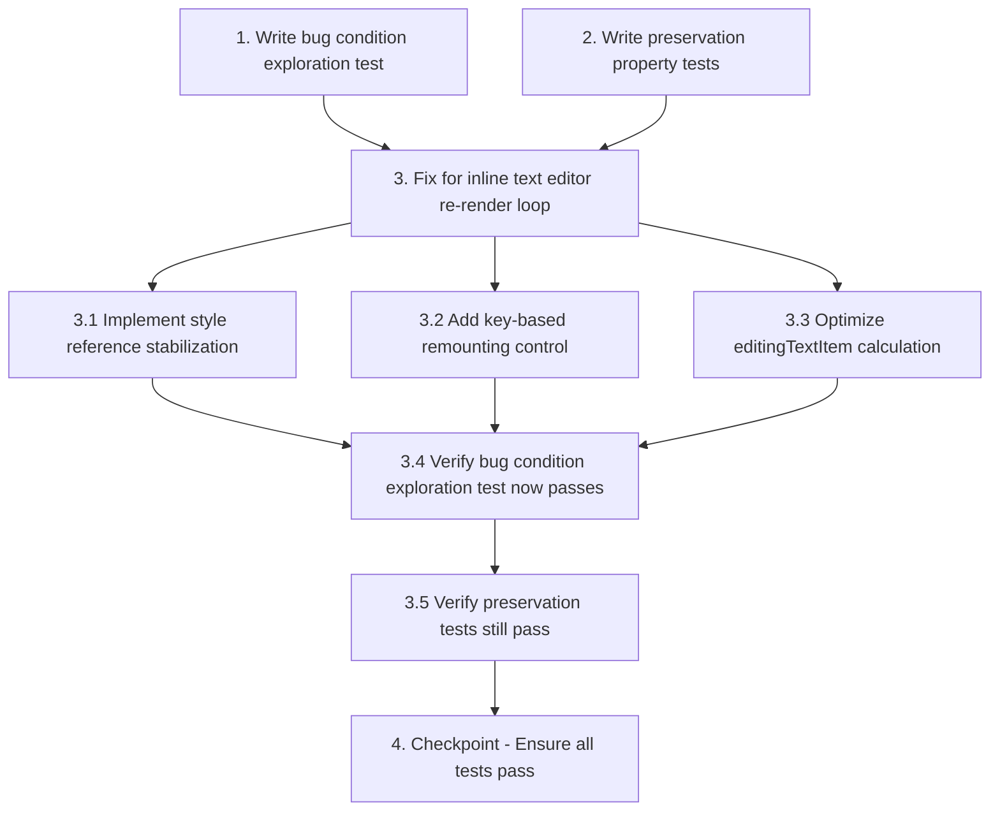

# Implementation Plan

## Overview

This implementation plan addresses a critical React re-render loop bug in the Workspace Canvas inline text editor. The bug causes the textarea to unmount and remount on every keystroke, preventing normal multi-character text composition. The fix stabilizes the textarea component by ensuring the style object reference remains stable across renders when only the text value changes.

The implementation follows the exploratory bugfix workflow:
1. **Explore** - Write tests BEFORE fix to understand the bug (Bug Condition)
2. **Preserve** - Write tests for non-buggy behavior (Preservation Requirements)
3. **Implement** - Apply the fix with understanding (Expected Behavior)
4. **Validate** - Verify fix works and doesn't break anything

## Tasks

- [ ] 1. Write bug condition exploration test
  - **Property 1: Bug Condition** - Textarea Unmounts on Keystroke
  - **CRITICAL**: This test MUST FAIL on unfixed code - failure confirms the bug exists
  - **DO NOT attempt to fix the test or the code when it fails**
  - **NOTE**: This test encodes the expected behavior - it will validate the fix when it passes after implementation
  - **GOAL**: Surface counterexamples that demonstrate the textarea DOM node unmounts/remounts on keystroke
  - **Scoped PBT Approach**: Scope the property to concrete failing cases - typing any character in the inline textarea editor
  - Test that typing a character in the inline textarea keeps the same DOM node reference (from Bug Condition in design)
  - The test assertions should match the Expected Behavior Properties from design:
    - Textarea DOM node remains mounted (same node reference before and after keystroke)
    - Character is appended to existing text (not replaced)
    - Cursor position advances naturally
    - No text selection occurs (no Ctrl+A behavior)
  - Run test on UNFIXED code
  - **EXPECTED OUTCOME**: Test FAILS (this is correct - it proves the bug exists)
  - Document counterexamples found:
    - Textarea node reference changes on each keystroke
    - Previous characters are replaced instead of appended
    - Cursor position resets to beginning
    - All text becomes selected before character insertion
  - Mark task complete when test is written, run, and failure is documented
  - _Requirements: 1.1, 1.2, 1.3, 1.4, 1.5_

- [ ] 2. Write preservation property tests (BEFORE implementing fix)
  - **Property 2: Preservation** - Non-Typing Interactions Unchanged
  - **IMPORTANT**: Follow observation-first methodology
  - Observe behavior on UNFIXED code for non-typing interactions:
    - Double-click text item → inline editor appears with focus and select-all
    - Click outside textarea → changes saved and edit mode exits
    - Press Escape → changes discarded and edit mode exits
    - Press Enter → changes saved and edit mode exits
    - Camera zoom/pan → textarea position updates correctly
    - Text item transform → dimensions and rotation update correctly
  - Write property-based tests capturing observed behavior patterns from Preservation Requirements
  - Property-based testing generates many test cases for stronger guarantees:
    - Test double-click on various text items (different positions, rotations, font sizes)
    - Test blur-to-save with different camera zoom levels
    - Test keyboard shortcuts (Escape, Enter) at various editing states
    - Test camera transformations during editing
  - Run tests on UNFIXED code
  - **EXPECTED OUTCOME**: Tests PASS (this confirms baseline behavior to preserve)
  - Mark task complete when tests are written, run, and passing on unfixed code
  - _Requirements: 3.1, 3.2, 3.3, 3.4, 3.5, 3.6_

- [ ] 3. Fix for inline text editor re-render loop

  - [ ] 3.1 Implement style reference stabilization
    - Add `useRef` to cache the `inlineTextEditorStyle` object reference
    - Implement deep comparison or stable dependency tracking to prevent unnecessary style recalculations
    - Ensure style only updates when `camera` or `editingTextItem` positioning/sizing properties actually change
    - Do NOT update style when only `editingText.value` changes (text content)
    - _Bug_Condition: isBugCondition(input) where input.type === 'input' AND input.target === inlineTextEditorRef.current AND editingText !== null_
    - _Expected_Behavior: Textarea DOM node remains mounted and stable during typing, allowing natural multi-character text composition_
    - _Preservation: Double-click to edit, initial focus/select-all, blur-to-save, Escape/Enter handlers, camera transformations, and Transformer hiding must remain unchanged_
    - _Requirements: 2.1, 2.2, 2.3, 2.4, 2.5, 3.1, 3.2, 3.3, 3.4, 3.5, 3.6_

  - [ ] 3.2 Add key-based remounting control
    - Add `key={editingText.id}` prop to the inline textarea element
    - This ensures textarea only remounts when editing a different text item (id changes)
    - Combined with style stabilization, this provides explicit lifecycle control
    - Prevents accidental remounts when only text value changes
    - _Bug_Condition: isBugCondition(input) where textarea remounts on every keystroke_
    - _Expected_Behavior: Textarea only remounts when switching to a different text item, not on value changes_
    - _Preservation: Initial focus/select-all behavior when entering edit mode must remain unchanged_
    - _Requirements: 2.3, 2.6, 3.1_

  - [ ] 3.3 Optimize editingTextItem calculation
    - Review `editingTextItem` useMemo dependencies
    - Ensure it only recalculates when `editingText.id` or `items` array actually changes
    - Prevent unnecessary recalculations on every render
    - This reduces the chance of triggering style recalculation cascades
    - _Bug_Condition: editingTextItem recalculates unnecessarily, triggering style updates_
    - _Expected_Behavior: editingTextItem only recalculates when id or items change_
    - _Preservation: All existing text item selection and editing behavior unchanged_
    - _Requirements: 2.3, 3.2_

  - [ ] 3.4 Verify bug condition exploration test now passes
    - **Property 1: Expected Behavior** - Textarea Stability During Typing
    - **IMPORTANT**: Re-run the SAME test from task 1 - do NOT write a new test
    - The test from task 1 encodes the expected behavior
    - When this test passes, it confirms the expected behavior is satisfied:
      - Textarea DOM node reference remains stable across keystrokes
      - Characters are appended correctly (typing "abc" results in "abc")
      - Cursor position advances naturally
      - No text selection occurs during typing
    - Run bug condition exploration test from step 1
    - **EXPECTED OUTCOME**: Test PASSES (confirms bug is fixed)
    - _Requirements: 2.1, 2.2, 2.3, 2.4, 2.5_

  - [ ] 3.5 Verify preservation tests still pass
    - **Property 2: Preservation** - Non-Typing Interactions Unchanged
    - **IMPORTANT**: Re-run the SAME tests from task 2 - do NOT write new tests
    - Run preservation property tests from step 2
    - **EXPECTED OUTCOME**: Tests PASS (confirms no regressions)
    - Confirm all preservation tests still pass after fix:
      - Double-click to edit with initial focus/select-all
      - Blur-to-save functionality
      - Escape key cancels editing
      - Enter key saves and exits
      - Camera transformations update textarea position
      - Transformer handles hidden during editing
    - If any preservation test fails, investigate and fix the regression before proceeding

- [ ] 4. Checkpoint - Ensure all tests pass
  - Run all tests (bug condition + preservation)
  - Verify textarea remains stable during typing
  - Verify multi-character text composition works correctly
  - Verify all non-typing interactions remain unchanged
  - Test manually in the browser:
    - Double-click a text item and type "Hello World" - should see complete text
    - Type quickly without pauses - all characters should be captured
    - Test with different zoom levels and camera positions
    - Test Escape and Enter key shortcuts
    - Test clicking outside to save
  - Ensure all tests pass, ask the user if questions arise

## Notes

### Testing Approach

This bugfix uses the bug condition methodology with property-based testing:
- **Bug Condition (C)**: Typing in the inline textarea causes DOM node unmount/remount
- **Expected Behavior (P)**: Textarea remains stable, allowing natural text composition
- **Preservation (¬C)**: All non-typing interactions remain unchanged

### Key Implementation Points

1. **Style Reference Stabilization**: Use `useRef` to cache the `inlineTextEditorStyle` object reference and prevent unnecessary recalculations when only text value changes
2. **Key-based Remounting Control**: Add `key={editingText.id}` to ensure textarea only remounts when editing a different text item
3. **Optimize editingTextItem**: Ensure it only recalculates when `editingText.id` or `items` array actually changes

### Manual Testing Checklist

After implementation, verify:
- [ ] Typing "Hello World" produces complete text (not just "d")
- [ ] Rapid typing captures all characters without loss
- [ ] Cursor position advances naturally after each keystroke
- [ ] No text selection occurs during normal typing
- [ ] Double-click still focuses and selects all text initially
- [ ] Blur, Escape, and Enter key handlers still work correctly
- [ ] Camera zoom/pan updates textarea position correctly

## Task Dependency Graph

```json
{
  "waves": [
    {
      "name": "Wave 1: Exploration & Preservation Tests",
      "tasks": ["1", "2"]
    },
    {
      "name": "Wave 2: Implementation",
      "tasks": ["3.1", "3.2", "3.3"]
    },
    {
      "name": "Wave 3: Verification",
      "tasks": ["3.4", "3.5"]
    },
    {
      "name": "Wave 4: Final Checkpoint",
      "tasks": ["4"]
    }
  ]
}
```



**Dependencies:**
- Task 1 (Bug Condition Test) must complete before Task 3 (Implementation)
- Task 2 (Preservation Tests) must complete before Task 3 (Implementation)
- Tasks 3.1, 3.2, 3.3 (Implementation subtasks) can be done in parallel
- Task 3.4 (Verify Bug Fix) depends on completion of all implementation subtasks
- Task 3.5 (Verify Preservation) depends on Task 3.4
- Task 4 (Checkpoint) depends on Task 3.5
